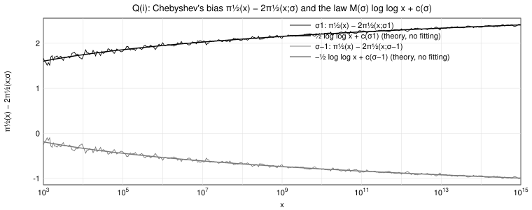
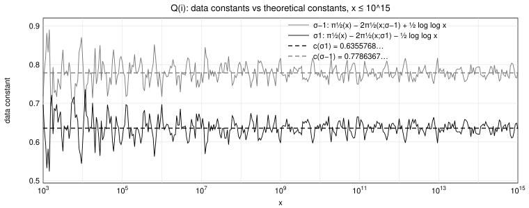

# L = **Q**(i), G = Gal(L/**Q**) = {σ1, σ−1}

Here σ1 is the identity and σ−1 is complex conjugation (σ−1(i) = −i). A prime p ≠ 2 has Frob_p = σ1 if p ≡ 1 (mod 4) and Frob_p = σ−1 if p ≡ 3 (mod 4); the prime 2 is ramified, so R = 1/√2. The only non-trivial character of G is the character χ mod 4 (χ(σ1) = 1, χ(σ−1) = −1), which is real, and M(σ1) = 1/2, M(σ−1) = −1/2: primes ≡ 1 mod 4 appear "late", primes ≡ 3 mod 4 "early".

The theorem reads, for σ ∈ {σ1, σ−1},

**π_(1/2)(x) − 2 π_(1/2)(x; σ) = M(σ)(log log x + γ) + 1/√2 − M(σ)(log 2 + c_Q) − χ(σ)( log L(1/2, χ) − c(χ) ) + o(1),**

with c_Q = − Σ_p (1/p + log(1 − 1/p)) and c(χ) = −1/4 + Σ_(k≥3) Σ_p χ(p^k) / (k p^(k/2)).

## Constants

| quantity | value |
|---|---|
| L(1/2, χ) | 0.667691457189609 |
| m(χ) = ord_(s=1/2) L(s, χ) | 0 |
| lowest non-trivial zero of L(s, χ): s = 1/2 + i γ1 | γ1 = 6.0209489047 |
| c_Q = γ − M_Mertens | 0.3157184520539 |
| c(χ) | -0.2596340772 |
| c(σ1) = γ/2 + 1/√2 − (log 2 + c_Q)/2 − (log L(1/2, χ) − c(χ)) | **0.6355768227** |
| c(σ−1) = −γ/2 + 1/√2 + (log 2 + c_Q)/2 + (log L(1/2, χ) − c(χ)) | **0.7786367396** |

(c(σ1) + c(σ−1) = 2R = √2 exactly.)

## Table

Left-hand sides π_(1/2)(x) − 2π_(1/2)(x; σ) and data constants D_σ(x) = left-hand side − M(σ) log log x.

| x | LHS, σ = σ1 | data constant, σ1 (→ 0.6355768227) | LHS, σ = σ−1 | data constant, σ−1 (→ 0.7786367396) |
|---|---|---|---|---|
| 10^5 | 1.828845339188 | 0.607110160347 | -0.414631776815 | 0.807103402026 |
| 10^6 | 2.010202326942 | 0.697306369704 | -0.595988764569 | 0.716907192669 |
| 10^7 | 2.023806012177 | 0.633834715025 | -0.609592449804 | 0.780378847348 |
| 10^8 | 2.074809158113 | 0.618072164649 | -0.660595595740 | 0.796141397724 |
| 10^9 | 2.113131081343 | 0.597502570051 | -0.698917518970 | 0.816710992322 |
| 10^10 | 2.214861055066 | 0.646552285945 | -0.800647492693 | 0.767661276428 |
| 10^11 | 2.253954627720 | 0.637990768697 | -0.839741065347 | 0.776222793676 |
| 10^12 | 2.319772907728 | 0.660303360210 | -0.905559345355 | 0.753910202163 |
| 10^13 | 2.336403276896 | 0.636912375541 | -0.922189714523 | 0.777301186832 |
| 10^14 | 2.356756188324 | 0.620211300892 | -0.942542625951 | 0.794002261481 |
| 10^15 | 2.405363745253 | 0.634322422078 | -0.991150182880 | 0.779891140295 |

(The full data, 128 checkpoints per decade from x = 100 to 10^15, is in `bias_mod4.csv`: columns `x`, `pi_x`, `lhs_sigma1`, `data_constant_sigma1`, `lhs_sigma_minus1`, `data_constant_sigma_minus1`.)

## Figure 1: the trajectories and the law M(σ) log log x + c(σ)

The thin curves are π_(1/2)(x) − 2π_(1/2)(x; σ) for σ1 (black, primes ≡ 1 mod 4) and σ−1 (grey, primes ≡ 3 mod 4), 10^3 ≤ x ≤ 10^15; the thick curves are ½ log log x + c(σ1) and −½ log log x + c(σ−1) with the theoretical constants above (no fitting). The two trajectories are exact mirror images of each other around R = 1/√2 (their sum is √2 for every x).

## Figure 2: the data constants

The curves are the data constants D_(σ1)(x) (black) and D_(σ−1)(x) (grey); the dashed lines are c(σ1) = 0.6355768… and c(σ−1) = 0.7786367…. Each curve oscillates around its limit inside an envelope that narrows like 1/log x; the slowest oscillation, with period 2π/γ1 ≈ 1.04 in log x (about 0.45 decades), comes from the lowest zero γ1 = 6.0209… of L(s, χ).
