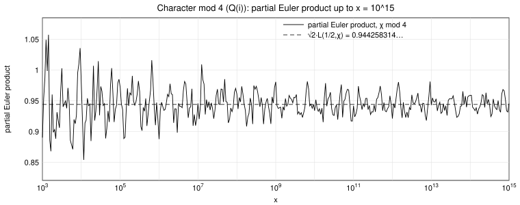

# The character mod 4

χ is the primitive Dirichlet character modulo 4:

χ(a) = 1 (a ≡ 1 mod 4),  χ(a) = −1 (a ≡ 3 mod 4),  χ(a) = 0 (a even).

Here m = ord_(s=1/2) L(s, χ) = 0 and χ² = 1, so ν(χ) = 1, and DRH (B) states

**lim_(x→∞) ∏_(p≤x) (1 − p^(−1/2) χ(p))^(−1) = √2 · L(1/2, χ).**

With L(1/2, χ) = 0.667691457189609 the conjectured limit is

**√2 · L(1/2, χ) = 0.944258314238200.**

## Table: partial Euler products ∏_(p≤x) (1 − p^(−1/2) χ(p))^(−1)

| x | partial Euler product |
|---|---|
| 10^5 | 0.971672466921 |
| 10^6 | 0.887749562976 |
| 10^7 | 0.945909275286 |
| 10^8 | 0.960934683899 |
| 10^9 | 0.980904162446 |
| 10^10 | 0.933951583458 |
| 10^11 | 0.941981741067 |
| 10^12 | 0.921196388130 |
| 10^13 | 0.942998054159 |
| 10^14 | 0.958879379961 |
| 10^15 | 0.945443536080 |

(The full data, 128 checkpoints per decade from x = 100 to 10^15, is in `partial_euler_product_mod4.csv`: columns `x`, `pi_x` = number of primes ≤ x, `partial_euler_product`.)

## Figure

The curve is the partial Euler product for 10^3 ≤ x ≤ 10^15; the dashed line is the conjectured limit √2 L(1/2, χ) = 0.944258314…. The curve oscillates around the limit with an envelope that narrows roughly like 1/log x; at x = 10^15 the value 0.945443536080 differs from the limit by 0.13 %.
