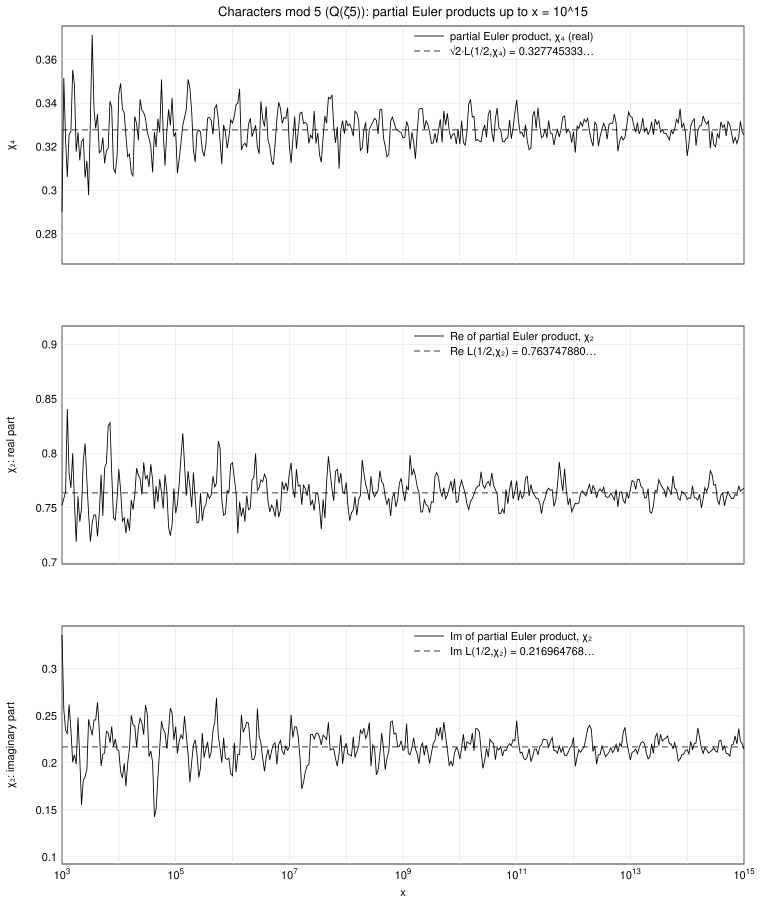

# The characters mod 5

The Dirichlet characters modulo 5 are:

| a mod 5 | 0 | 1 | 2 | 3 | 4 | |
|---|---|---|---|---|---|---|
| χ1(a) | 0 | 1 | 1 | 1 | 1 | trivial, not primitive |
| χ2(a) | 0 | 1 | i | −i | −1 | primitive, order 4 |
| χ3(a) = conj χ2(a) | 0 | 1 | −i | i | −1 | primitive, order 4 |
| χ4(a) = (a/5) | 0 | 1 | −1 | −1 | 1 | primitive, real (quadratic) |

For i = 2, 3, 4 one has m = ord_(s=1/2) L(s, χi) = 0. Since χ2² = χ3² = χ4 ≠ 1 and χ4² = 1, we have ν(χ2) = ν(χ3) = 0 and ν(χ4) = 1, so DRH (B) states

**lim_(x→∞) ∏_(p≤x) (1 − p^(−1/2) χi(p))^(−1) = L(1/2, χi)  (i = 2, 3),  = √2 · L(1/2, χ4)  (i = 4).**

The conjectured limits are

| character | limit |
|---|---|
| χ2 | L(1/2, χ2) = 0.763747880117 + 0.216964767519 i |
| χ3 | L(1/2, χ3) = 0.763747880117 − 0.216964767519 i  (complex conjugate of the above) |
| χ4 | √2 · L(1/2, χ4) = 0.327745333052994  (L(1/2, χ4) = 0.231750947504016) |

Note that for the complex characters χ2, χ3 there is **no factor √2**, while for the real character χ4 there is. The partial products for χ3 are the complex conjugates of those for χ2 at every x (because χ3(p) = conj χ2(p)), so they carry the same information.

## Table: partial Euler products ∏_(p≤x) (1 − p^(−1/2) χi(p))^(−1)

| x | χ2 | χ3 | χ4 |
|---|---|---|---|
| 10^5 | 0.745059925 +0.238382275 i | 0.745059925 -0.238382275 i | 0.326547073261 |
| 10^6 | 0.791488633 +0.186397429 i | 0.791488633 -0.186397429 i | 0.330797485580 |
| 10^7 | 0.781746548 +0.216994407 i | 0.781746548 -0.216994407 i | 0.320619903626 |
| 10^8 | 0.773259603 +0.220921370 i | 0.773259603 -0.220921370 i | 0.332076753951 |
| 10^9 | 0.765529242 +0.213361130 i | 0.765529242 -0.213361130 i | 0.323971830472 |
| 10^10 | 0.768953108 +0.204042673 i | 0.768953108 -0.204042673 i | 0.321140911486 |
| 10^11 | 0.774842607 +0.244666981 i | 0.774842607 -0.244666981 i | 0.341454396346 |
| 10^12 | 0.750290467 +0.227003726 i | 0.750290467 -0.227003726 i | 0.326875113352 |
| 10^13 | 0.766680240 +0.203144322 i | 0.766680240 -0.203144322 i | 0.333938501336 |
| 10^14 | 0.757637016 +0.214064963 i | 0.757637016 -0.214064963 i | 0.315760239824 |
| 10^15 | 0.767629772 +0.214339108 i | 0.767629772 -0.214339108 i | 0.325443055428 |

(The full data, 128 checkpoints per decade from x = 100 to 10^15, is in `partial_euler_products_mod5.csv`: columns `x`, `pi_x`, `product_chi2_re`, `product_chi2_im`, `product_chi4`.)

## Figure

Top: the real character χ4, with the limit √2 L(1/2, χ4) (dashed). Middle and bottom: real and imaginary parts of the product for the complex character χ2, with Re L(1/2, χ2) and Im L(1/2, χ2) (dashed). All three curves oscillate around their limits inside envelopes that narrow like 1/log x; at x = 10^15 the χ4 product differs from its limit by 0.70 % and the χ2 product by 0.59 % (in absolute value). If the factor √2 were wrongly applied to χ2, the discrepancy would be about 29 % throughout, so the data distinguish the two cases ν = 0 and ν = 1 clearly.
