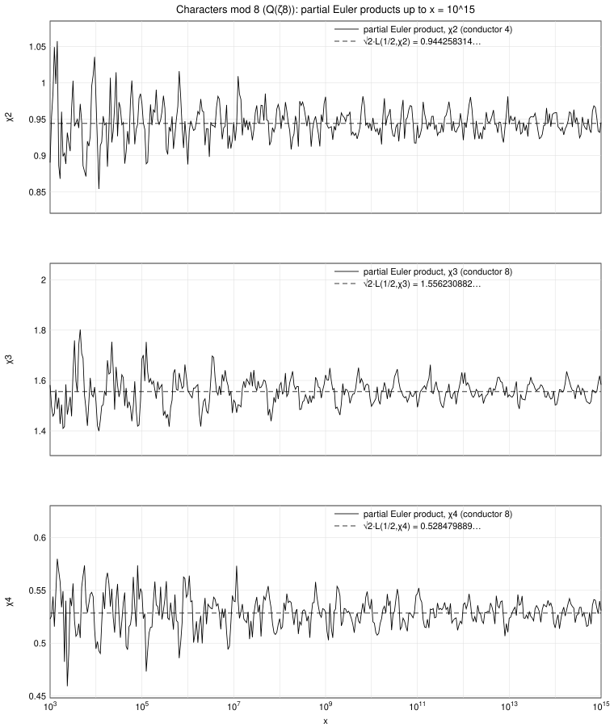

# The characters mod 8

The Dirichlet characters modulo 8 are:

| a mod 8 | 1 | 3 | 5 | 7 | conductor | |
|---|---|---|---|---|---|---|
| χ₁(a) | 1 | 1 | 1 | 1 | 1 | trivial, not primitive |
| χ₂(a) | 1 | −1 | 1 | −1 | 4 | not primitive mod 8 (it is the character mod 4 of `mod4_Dirichlet_char/`) |
| χ₃(a) | 1 | 1 | −1 | −1 | 8 | primitive; χ₃(p) = (−2/p), the character of **Q**(√−2) |
| χ₄(a) | 1 | −1 | −1 | 1 | 8 | primitive; χ₄(p) = (2/p), the character of **Q**(√2) |

(χᵢ(a) = 0 for even a.) For i = 2, 3, 4 one has m = ord_(s=1/2) L(s, χᵢ) = 0 and χᵢ² = 1, so ν(χᵢ) = 1 and DRH (B) states

**lim_(x→∞) ∏_(p≤x) (1 − p^(−1/2) χᵢ(p))^(−1) = √2 · L(1/2, χᵢ)  (i = 2, 3, 4).**

| character | L(1/2, χᵢ) | limit √2 · L(1/2, χᵢ) |
|---|---|---|
| χ₂ | 0.667691457189609 | 0.944258314238200 |
| χ₃ | 1.100421409525548 | 1.556230881676749 |
| χ₄ | 0.373691712912547 | 0.528479888547358 |

Since χ₂(p) coincides with the character mod 4 for every prime p, its partial Euler products are exactly the numbers of `mod4_Dirichlet_char/`.

## Table: partial Euler products ∏_(p≤x) (1 − p^(−1/2) χᵢ(p))^(−1)

| x | χ₂ | χ₃ | χ₄ |
|---|---|---|---|
| 10^5 | 0.971672466921 | 1.685951012326 | 0.548054790262 |
| 10^6 | 0.887749562976 | 1.561725571103 | 0.546460764605 |
| 10^7 | 0.945909275286 | 1.521663942029 | 0.539992353402 |
| 10^8 | 0.960934683899 | 1.580485009937 | 0.523234810090 |
| 10^9 | 0.980904162446 | 1.621930254814 | 0.529472319230 |
| 10^10 | 0.933951583458 | 1.497336140568 | 0.541699271479 |
| 10^11 | 0.941981741067 | 1.493443786250 | 0.547045910505 |
| 10^12 | 0.921196388130 | 1.587468132019 | 0.536625560213 |
| 10^13 | 0.942998054159 | 1.543242642925 | 0.523503993107 |
| 10^14 | 0.958879379962 | 1.502537269044 | 0.514440425062 |
| 10^15 | 0.945443536080 | 1.583277160698 | 0.530788303261 |

(The full data, 128 checkpoints per decade from x = 100 to 10^15, is in `partial_euler_products_mod8.csv`: columns `x`, `pi_x`, `product_chi2`, `product_chi3`, `product_chi4`.)

## Figure

Each panel shows the partial Euler product of one character with its conjectured limit √2 L(1/2, χᵢ) (dashed). The curves oscillate around the limits inside envelopes that narrow like 1/log x; at x = 10^15 the products differ from their limits by 0.13 % (χ₂), 1.74 % (χ₃) and 0.44 % (χ₄).
