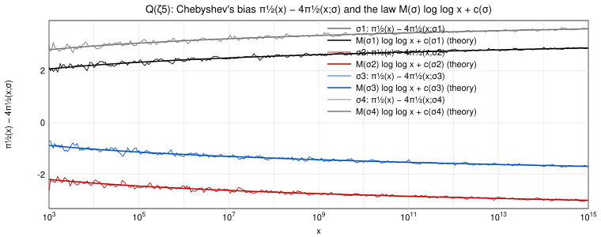
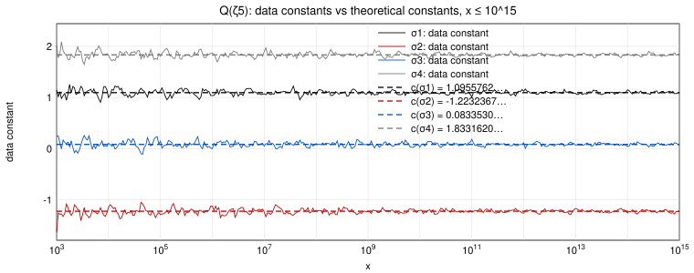

# L = **Q(ζ5)**, G = Gal(L/**Q**) = {σ1, σ2, σ3, σ4}

σa is the automorphism ζ5 ↦ ζ5^a, and a prime p ≠ 5 has Frob_p = σa exactly when p ≡ a (mod 5); the prime 5 is ramified, so R = Σ_(p|D_L) p^(−1/2) = 1/√5. The non-trivial irreducible characters of G are one-dimensional: ρ₂ with ρ₂(σ1) = 1, ρ₂(σ2) = i, ρ₂(σ3) = −i, ρ₂(σ4) = −1; ρ₃ = conj ρ₂; and ρ₄ = ρ₂² with ρ₄(σ1) = ρ₄(σ4) = 1, ρ₄(σ2) = ρ₄(σ3) = −1, which is real. **M(σ1) = M(σ4) = 1/2, M(σ2) = M(σ3) = −1/2**, and m(σ) = 0 for all σ. If we identify ρ₂, ρ₃, ρ₄ with the Dirichlet characters χ₂, χ₃, χ₄ modulo 5 of `1_partial_euler_products/mod5_Dirichlet_char/`, then the Artin L-functions for ρ₂, ρ₃, ρ₄ coincide with the Dirichlet L-functions for χ₂, χ₃, χ₄.

The theorem reads, for σ ∈ G,

**π_(1/2)(x) − 4 π_(1/2)(x; σ) = M(σ) log log x + c(σ) + o(1),**

with c(σ) = M(σ) γ + R − M(σ)(log 2 + c_Q) − Σ_(χ = χ₂, χ₃, χ₄) χ̄(σ)( log L(1/2, χ) − c(χ) ), c_Q = − Σ_p (1/p + log(1 − 1/p)), c(χ₄) = −1/10 + Σ_(k≥3) Σ_p χ₄(p^k)/(k p^(k/2)) and, for the complex characters, c(χ₂) = ½ Σ_p χ₄(p)/p + Σ_(k≥3) Σ_p χ₂(p^k)/(k p^(k/2)), c(χ₃) = conj c(χ₂). The coefficient of log L(1/2, χ) − c(χ) is the complex conjugate χ̄(σ) = χ(σ)^(−1).

## Constants

| quantity | value |
|---|---|
| L(1/2, χ₂) = conj L(1/2, χ₃) | 0.763747880117 + 0.216964767519 i |
| L(1/2, χ₄) | 0.231750947504016 |
| m(χ₂) = m(χ₃) = m(χ₄) = ord_(s=1/2) L(s, χᵢ) | 0 |
| lowest non-trivial zero of L(s, χ₂): s = 1/2 + i γ1 (for χ₃ the sign of γ1 is reversed) | γ1 = -4.1329037052 |
| lowest non-trivial zero of L(s, χ₄): s = 1/2 ± i γ1 | γ1 = 6.6484533447 |
| c_Q = γ − M_Mertens | 0.3157184520539 |
| c(χ₄) = −1/10 + Σ_(k≥3) Σ_p χ₄(p^k)/(k p^(k/2)) | -0.2291115410 |
| c(χ₂) = ½ Σ_p χ₄(p)/p + Σ_(k≥3) Σ_p χ₂(p^k)/(k p^(k/2)) = conj c(χ₃) | -0.4151090843 -0.0498602292 i |
| c(σ1) | **1.0955761614** |
| c(σ2) | **-1.2232366831** |
| c(σ3) | **0.0833529517** |
| c(σ4) | **1.8331619520** |

(Σ_σ c(σ) = 4R = 4/√5 = 1.7888543820.)

## Table

Left-hand sides π_(1/2)(x) − 4π_(1/2)(x; σa) and data constants D_σ(x) = left-hand side − M(σa) log log x.

| x | LHS σ1 | data const. σ1 (→ 1.0955762) | LHS σ2 | data const. σ2 (→ -1.2232367) | LHS σ3 | data const. σ3 (→ 0.0833530) | LHS σ4 | data const. σ4 (→ 1.8331620) |
|---|---|---|---|---|---|---|---|---|
| 10^5 | 2.3510560829 | 1.1293209041 | -2.5145287893 | -1.2927936104 | -1.0764553247 | 0.1452798541 | 3.0287824130 | 1.8070472342 |
| 10^6 | 2.3515701395 | 1.0386741823 | -2.4358841770 | -1.1229882198 | -1.3112914760 | 0.0016044813 | 3.1844598955 | 1.8715639383 |
| 10^7 | 2.4643437233 | 1.0743724261 | -2.6231387806 | -1.2331674834 | -1.3406582422 | 0.0493130550 | 3.2883076815 | 1.8983363844 |
| 10^8 | 2.5135829417 | 1.0568459482 | -2.6698476245 | -1.2131106310 | -1.3572556329 | 0.0994813606 | 3.3023746977 | 1.8456377042 |
| 10^9 | 2.6209270113 | 1.1052985000 | -2.7404972153 | -1.2248687040 | -1.4538056504 | 0.0618228608 | 3.3622302364 | 1.8466017251 |
| 10^10 | 2.6802246508 | 1.1119158817 | -2.7770760879 | -1.2087673188 | -1.5401395325 | 0.0281692366 | 3.4258453517 | 1.8575365825 |
| 10^11 | 2.6242851498 | 1.0083212908 | -2.8563594351 | -1.2403955761 | -1.4334976602 | 0.1824661989 | 3.4544263274 | 1.8384624684 |
| 10^12 | 2.7832800916 | 1.1238105441 | -2.9193879572 | -1.2599184097 | -1.5447523084 | 0.1147172391 | 3.4697145560 | 1.8102450085 |
| 10^13 | 2.7784406171 | 1.0789497158 | -2.8684614945 | -1.1689705931 | -1.6329641201 | 0.0665267813 | 3.5118393795 | 1.8123484781 |
| 10^14 | 2.8862471475 | 1.1497022600 | -2.9941912605 | -1.2576463731 | -1.6932896326 | 0.0432552549 | 3.5900881274 | 1.8535432400 |
| 10^15 | 2.8660621257 | 1.0950208025 | -2.9923272345 | -1.2212859113 | -1.7037379064 | 0.0673034168 | 3.6188573977 | 1.8478160745 |

(The full data, 128 checkpoints per decade from x = 100 to 10^15, is in `bias_mod5.csv`. Since the class sums are of size 10^6 at x = 10^15, about 10 decimals of the left-hand sides are significant; 10 are printed.)

## Figure 1: the trajectories and the law M(σ) log log x + c(σ)

The thin curves are π_(1/2)(x) − 4π_(1/2)(x; σa) for the four classes, 10^3 ≤ x ≤ 10^15; the thick curves are M(σa) log log x + c(σa) with the theoretical constants above (no fitting). The sum of the four left-hand sides is 4R for every x.

## Figure 2: the data constants

The curves are the data constants D_σ(x) for the four classes; the dashed lines are the theoretical constants c(σa). Each curve oscillates around its own constant inside an envelope that narrows like 1/log x.

The pair σ2, σ3 (primes ≡ 2 and ≡ 3 mod 5) is not symmetric: the two constants differ by 2 Im( log L(1/2, χ₂) − c(χ₂) ), which is where the complex characters enter.
