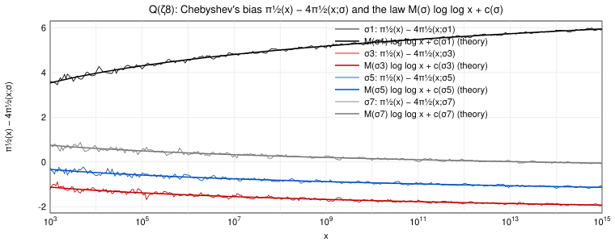
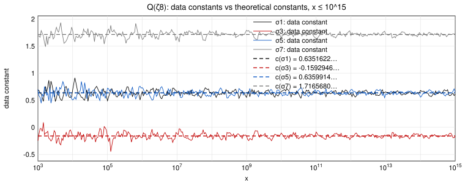

# L = **Q(ζ8)**, G = Gal(L/**Q**) = {σ1, σ3, σ5, σ7}

σa is the automorphism ζ8 ↦ ζ8^a, and an odd prime p has Frob_p = σa exactly when p ≡ a (mod 8); the prime 2 is ramified, so R = Σ_(p|D_L) p^(−1/2) = 1/√2. The non-trivial irreducible characters of G are one-dimensional and real: ρ₂, ρ₃, ρ₄ with (ρ₂, ρ₃, ρ₄)(σ1) = (1, 1, 1), (σ3) = (−1, 1, −1), (σ5) = (1, −1, −1), (σ7) = (−1, −1, 1). Hence M(σ) = ½ (ρ₂(σ) + ρ₃(σ) + ρ₄(σ)): **M(σ1) = 3/2, M(σ3) = M(σ5) = M(σ7) = −1/2**, and m(σ) = 0 for all σ. If we identify ρ₂, ρ₃, ρ₄ with the Dirichlet characters χ₂, χ₃, χ₄ modulo 8 of `1_partial_euler_products/mod8_Dirichlet_char/`, then the Artin L-functions for ρ₂, ρ₃, ρ₄ coincide with the Dirichlet L-functions for χ₂, χ₃, χ₄.

The theorem reads, for σ ∈ G,

**π_(1/2)(x) − 4 π_(1/2)(x; σ) = M(σ) log log x + c(σ) + o(1),**

with c(σ) = M(σ) γ + R − M(σ)(log 2 + c_Q) − Σ_(χ = χ₂, χ₃, χ₄) χ(σ)( log L(1/2, χ) − c(χ) ), c_Q = − Σ_p (1/p + log(1 − 1/p)) and c(χ) = −1/4 + Σ_(k≥3) Σ_p χ(p^k)/(k p^(k/2)) for each of the three characters.

## Constants

| quantity | value |
|---|---|
| L(1/2, χ₂), L(1/2, χ₃), L(1/2, χ₄) | 0.667691457190, 1.100421409526, 0.373691712913 |
| m(χ₂) = m(χ₃) = m(χ₄) = ord_(s=1/2) L(s, χ) | 0 |
| lowest non-trivial zero s = 1/2 ± i γ1 of L(s, χ₂), L(s, χ₃), L(s, χ₄) | γ1 = 6.0209489047, 3.5761548368, 4.8999739970 |
| c_Q = γ − M_Mertens | 0.3157184520539 |
| c(χ₂), c(χ₃), c(χ₄) = −1/4 + Σ_(k≥3) Σ_p χ(p^k)/(k p^(k/2)) | -0.2596340772, -0.1576547473, -0.2997407758 |
| c(σ1) | **0.6351622444** |
| c(σ3) | **-0.1592945563** |
| c(σ5) | **0.6359914010** |
| c(σ7) | **1.7165680356** |

(Σ_σ c(σ) = 4R = 2√2 = 2.8284271247.)

## Table

Left-hand sides π_(1/2)(x) − 4π_(1/2)(x; σa) and data constants D_σ(x) = left-hand side − M(σa) log log x.

| x | LHS σ1 | data const. σ1 (→ 0.6351622) | LHS σ3 | data const. σ3 (→ -0.1592946) | LHS σ5 | data const. σ5 (→ 0.6359914) | LHS σ7 | data const. σ7 (→ 1.7165680) |
|---|---|---|---|---|---|---|---|---|
| 10^5 | 4.1557724296 | 0.4905668930 | -1.3962555147 | -0.1745203358 | -0.4980817512 | 0.7236534276 | 0.5669919610 | 1.7887271399 |
| 10^6 | 4.5986363286 | 0.6599484569 | -1.5039868570 | -0.1910908997 | -0.5782316747 | 0.7346642825 | 0.3120093278 | 1.6249052851 |
| 10^7 | 4.8042557344 | 0.6343418430 | -1.5035111569 | -0.1135398598 | -0.7566437101 | 0.6333275871 | 0.2843262573 | 1.6742975545 |
| 10^8 | 4.9823820446 | 0.6121710642 | -1.6239662833 | -0.1672292899 | -0.8327637284 | 0.6239732651 | 0.3027750919 | 1.7595120853 |
| 10^9 | 5.1007487143 | 0.5538631804 | -1.6763228381 | -0.1606943268 | -0.8744865516 | 0.6411419597 | 0.2784878002 | 1.7941163115 |
| 10^10 | 5.3649375324 | 0.6600112250 | -1.6752933683 | -0.1069845992 | -0.9352154223 | 0.6330933469 | 0.0739983829 | 1.6423071521 |
| 10^11 | 5.4921220062 | 0.6442304291 | -1.7019623044 | -0.0859984454 | -0.9842127507 | 0.6317511083 | 0.0224801737 | 1.6384440327 |
| 10^12 | 5.6031280596 | 0.6247194170 | -1.8480684024 | -0.1885988549 | -0.9635822440 | 0.6958873035 | 0.0369497116 | 1.6964192591 |
| 10^13 | 5.7528115858 | 0.6543388817 | -1.8612001218 | -0.1617092205 | -1.0800050322 | 0.6194858691 | 0.0168206930 | 1.7163115943 |
| 10^14 | 5.8914679872 | 0.6818333249 | -1.8722873129 | -0.1357424254 | -1.1779556088 | 0.5585892786 | -0.0127979409 | 1.7237469466 |
| 10^15 | 5.9254432451 | 0.6123192756 | -1.9419530188 | -0.1709116956 | -1.1147157548 | 0.6563255684 | -0.0403473468 | 1.7306939764 |

(The full data, 128 checkpoints per decade from x = 100 to 10^15, is in `bias_mod8.csv`. Since the class sums are of size 10^6 at x = 10^15, about 10 decimals of the left-hand sides are significant; 10 are printed.)

## Figure 1: the trajectories and the law M(σ) log log x + c(σ)

The thin curves are π_(1/2)(x) − 4π_(1/2)(x; σa) for the four classes, 10^3 ≤ x ≤ 10^15; the thick curves are M(σa) log log x + c(σa) with the theoretical constants above (no fitting). The sum of the four left-hand sides is 4R for every x.

## Figure 2: the data constants

The curves are the data constants D_σ(x) for the four classes; the dashed lines are the theoretical constants c(σa). Each curve oscillates around its own constant inside an envelope that narrows like 1/log x.
